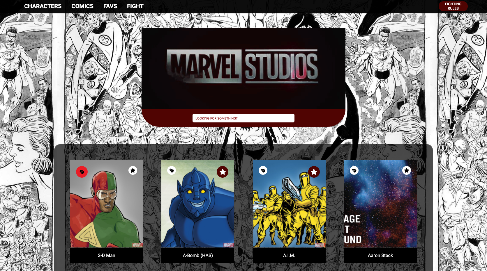

 
 
<h1>Marvel (Front : React.js / Back : Node.js)</h1>
 

Fullstack Web app to show Marvel universe. 
You can find the Backend code<a href="https://github.com/Mobu34/marvel_backend"> here</a>.
 
Usage of the <a href="https://developer.marvel.com/">Marvel Developer API</a>.

<h3>

You can find the <a href="https://marvel-by-lucas.netlify.app">Live Demo here !</a>

</h3>
 
 

 
<h2 style="color:#530401" >Features</h2>
<ul>
  <li>Find all characters & comics from Marvel universe</li>
  
  <li>Add characters/comics in favorites</li>
  <li>Organize a fight between 2 characters</li>
  
  <li>Search specific characters/comics</li>
  
  
 
  </ul>

 
<h2 style="color:#530401">Packages used</h2>

<ul>
  <li>react</li>
  <li>react-router-dom</li>
  <li>redux</li>
  <li>axios</li>
  <li>js-cookie</li>
  <li>react-loader-spinner</li>
  <li>react-fontawesome</li>

  </ul>

 
<h2 style="color:#530401">Install</h2>

Just run <code>yarn</code> in your console to install all dependencies and <code>yarn start</code> to launch.

 
